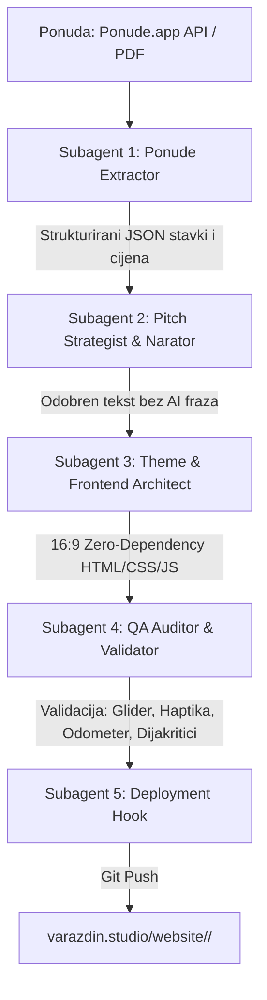

# AGENTS.md — Operativni sustav za prezentacijske mikrosajtove (varazdin.studio)

Ovaj dokument je **zakon za razvoj interaktivnih prezentacijskih mikrosajtova i pitch deckova** koji se izrađuju za klijente, povezuju s ponudama iz `Ponude.app` i objavljuju pod domenom **`varazdin.studio`**.

Svaki agent (glavni orkestrator, strateg, tekstopisac, frontend inženjer, motion dizajner, QA auditor) obvezan je pročitati i primijeniti ova pravila prije i tijekom rada.

---

## 1. Svrha i tehnički standardi prezentacijskih mikrosajtova

Prezentacijski mikrosajtovi predstavljaju najviši rang digitalne komunikacije s klijentima:
- **Kinematografsko, interaktivno iskustvo:** Zamjenjuje statične PDF prezentacije živim web-deckom koji radi savršeno i na 4K konferencijskim ekranima i na mobilnim uređajima.
- **Povezanost sa stvarnim ponudama:** Svaki mikrosajt je izravno mapiran na ponudu iz `Ponude.app` (ili odgovarajući PDF u `Ponude/`), osiguravajući točnost cijena, stavki, zakonskih klauzula i rokova.
- **Zero-Dependency Vanilla arhitektura:** Isključivo čisti HTML5, CSS3 i moderni ES6+ JavaScript. Nema npm paketa, nema React/Vue overheada, nema vanjskih build koraka koji bi mogli zastarjeti ili puknuti.
- **Instantno učitavanje i 60fps:** Sve animacije i prijelazi moraju biti hardverski ubrzani (`transform: translate3d/scale`, `opacity`).
- **Puna samostalnost:** Cjelokupan mikrosajt funkcionira unutar jedne mape (`website/<slug>/`), spreman za cPanel Git deployment.

---

## 2. Hosting i Deployment Arhitektura (`varazdin.studio`)

### A. Struktura mapa
Svi mikrosajtovi organizirani su unutar repozitorija `varazdin.studio`:
```
varazdin.studio/
├── .cpanel.yml                 # Automatska skripta za cPanel deployment
├── website/                    # Izvorna web mapa
│   ├── index.html              # Glavna stranica studija
│   │
│   ├── <client-slug>/          # PREZENTACIJSKI MIKROSAJT KLIJENTA
│   │   ├── index.html          # Glavni interaktivni deck (samostalan)
│   │   ├── assets/             # Slike visoke razlučivosti, logo, video, fontovi
│   │   └── api/                # Opcionalni mikro-PHP endpointi (npr. vote.php, feedback.php)
```

### B. Deployment protokol (.cpanel.yml)
Nakon svakog `git push` na repozitorij `timon2200/varazdin.studio`, cPanel deployment hook izvršava:
```yaml
---
deployment:
  tasks:
    - export DEPLOYPATH=$HOME/public_html/
    - /bin/cp -R website/* $DEPLOYPATH
```
**Live URL klijenta:** `https://varazdin.studio/<client-slug>/` (npr. `https://varazdin.studio/meridian16/` ili `https://varazdin.studio/komunalni-projekt/`).

---

## 3. Dizajnerski sustav i palete tema

Svaki mikrosajt prilagođava paletu i tipografiju brendu i industriji klijenta, ali zadržava besprijekoran autorski potpis Studio Varaždin:

### A. Tipografski sustavi (Google Fonts)
1. **Modern Editorial / Brutalist Tech (Standard za komercijalne filmove i inovacije):**
   - Headings: `'Syne', sans-serif` (700/800/900) ili `'Unbounded', sans-serif` (800/900)
   - Body: `'Plus Jakarta Sans', sans-serif` (500/700/800)
   - Data / Badges / Code: `'JetBrains Mono', monospace` (700/800)
2. **Luxury Storytelling / Dark Immersive (Standard za adventske i kulturne projekte):**
   - Headings: `'Playfair Display', serif` (700/900)
   - Body: `'Inter', sans-serif` (300/400/500/600)
3. **Clean Eco-Utility / Studio Minimal (Standard za komunalne, javne i održive projekte):**
   - Headings: `'Syne', sans-serif` (800/900)
   - Body: `'Plus Jakarta Sans', sans-serif` (500/700)
   - Accents / Tags: `'JetBrains Mono', monospace` (700)

### B. Palete tema (CSS Varijable)
- **1. Clean Eco-Studio & Utility (`eco-utility`):**
  ```css
  :root {
    --bg-canvas: #f2f7f4;
    --bg-card: #ffffff;
    --bg-card-subtle: #e6f1ec;
    --text-primary: #0d1815;
    --text-secondary: #2d3f3a;
    --text-muted: #647a74;
    --border-dark: #0d1815;
    --border-color: #c4d7cf;
    --accent-green: #0d5c3a;
    --accent-green-bright: #10b981;
    --accent-green-bg: #e0f6eb;
    --accent-green-border: #a1dcc2;
  }
  ```
- **2. Topla urednička paleta (`editorial-canvas`):**
  ```css
  :root {
    --bg-canvas: #f4efe4;
    --bg-card: #fbf7ee;
    --bg-card-subtle: #eae3d2;
    --text-primary: #111518;
    --text-secondary: #3b454e;
    --text-muted: #79828a;
    --border-dark: #111518;
    --border-color: #d5ccba;
    --accent-green: #11421f;
    --accent-green-bright: #177331;
    --accent-green-bg: #e1ede4;
  }
  ```
- **3. Studio Varaždin Dark Luxury (`dark-luxury`):**
  ```css
  :root {
    --bg-canvas: #171E19;
    --bg-card: #1f2722;
    --text-primary: #F5EFE3;
    --accent-gold: #D0A041;
    --accent-gold-bright: #F6CF65;
    --accent-oxblood: #4E110C;
    --border-dark: #2c362f;
  }
  ```

---

## 4. Komponente i interaktivni mehanizmi (Obvezna matrica)

Svaki prezentacijski mikrosajt mora implementirati sljedeći set mikro-interakcija:

### 1. Fiksna 16:9 pozornica i mobilna responzivnost
- **Desktop:** Fiksni 16:9 omjer (`aspect-ratio: 16 / 9; max-height: calc(100vh - 135px);`), savršeno centriran s 2px brutalist obrubom i taktilnom sjenom (`box-shadow: 8px 8px 0px rgba(13, 24, 21, 0.16)`).
- **Mobile (< 768px):** Automatski prelazak u vertikalni fluidni scroll feed bez fiksnog omjera, s prilagođenom tipografijom i karticama u jednom stupcu.

### 2. Centrirani Liquid Morphing Pill Indikator
- Paginacijska traka u podnožju je **apsolutno fiksirana u središtu ekrana** (`left: 50%; transform: translate(-50%, -50%)`), čime se sprječava bilo kakvo pomicanje pri promjeni naslova slajda na lijevoj strani.
- Glider kapsula (`.nav-pill`) izvodi smjerno stiskanje i rastezanje (`@keyframes squishForward` / `squishBackward`) s glatkim sheen svjetlosnim sweepom.
- Pregledani slajdovi zadržavaju decentnu toniranu boju (`.visited`).

### 3. Micro-Interaction Hover Tooltips
- Lebdeće kartice iznad svakog indikatora koje pri prelasku mišem prikazuju redni broj `[ 0X ]` i puni naslov slajda uz elastični opružni easing.

### 4. Precision Odometer Rolling Counter
- Brojač slajdova (`01 / 06`) s vertikalnom rotacijom pojedinačnih znamenki (`roll-up` / `roll-down`) sinkroniziranom s prijelazom slajda.

### 5. Zero-Dependency Audio Haptics (Web Audio API)
- Sintetizirani mehanički klik frekvencijskog raspona `1100Hz -> 320Hz` (naprijed) i `850Hz -> 300Hz` (natrag), bez vanjskih zvučnih datoteka. Uključivanje/isključivanje tipkom `M` ili gumbom u navigaciji.

### 6. Taktilni Keyboard & Gesture kontroler
- Navigacija tipkovnicom (`←` / `→`, `Space`, `Enter`, `PageUp` / `PageDown`, `1`–`6`, `F` za fullscreen, `M` za zvuk).
- Pritiskom na tipkovničke strelice, gumbi na ekranu (`btnPrev`, `btnNext`) vidljivo se utiskuju (`transform: translate(2.5px, 2.5px)`).

### 7. CanvasUI grafički slojevi
- **Ambijentalne čestice:** Lebdeće mikro-čestice u pozadini s fizikom odbijanja od miša i naletom vjetra (`triggerCanvasUiWind`) pri promjeni slajdova.
- **Bayer Dither leća:** 4x4 Bayer dithering efekt pri prelasku mišem preko kartica i vizuala.

### 8. Obvezni Hero PDF Download i Autorizacijski blok (Slajd 6)
- **Dvostruka akcijska mreža (`.slide-actions-grid`):**
  1. **Veliki brutalistički gumb za preuzimanje službene PDF ponude (`.btn-pdf-hero`):** Povezan izravno s PDF dokumentom ponude iz `Ponude.app` pohranjenim u `assets/`, s prikazom broja ponude, točnog iznosa i A4 specifikacije.
  2. **Gumb za direktnu autorizaciju / prihvat ponude (`.btn-auth-hero`):** Otvara pripremljenu e-mail poruku za potvrdu projekta i rezervaciju termina snimanja.
  3. **Izdavatelj i pravni podaci studija (`.issuer-footer-meta`):** Navedeni u podnožju slajda.

### 9. CanvasUI 3D WebGL Cloth & Dynamic Physics Engine (Zastave, Viseći paketi, Tkanine)
- **Zero-Dependency WebGL2 Arhitektura:** 96×96 mreža (18.432 trokuta) s fizikom valova i prigušenja, sjenčanjem i SDF obrezivanjem.
- **Direct 2D Canvas Rasterizacija:** Tekstura se generira preko 2D `OffscreenCanvasa` u dvostrukoj rezoluciji (`dpr: 2`) i prosljeđuje u `gl.texImage2D` u 0ms, čime se eliminiraju CORS i SVG blokade.
- **Podržani modovi sidrenja:**
  - `pin: 'top'` — Viseći paketi ponude i cjenici s gravitacijskim objesom.
  - `pin: 'left'` — Vijorenje zastava na jarbolu (gradske, državne, korporativne).
  - `pin: 'corners'` — Zategnuta elastična platna i interaktivni panoi.
- **Sigurnosni lifecycle:** `MutationObserver` aktivira WebGL i `resize()` točno u trenutku prijelaza na slajd, uz Zero-Size Guard (`w < 30px`) koji sprječava rušenje na skrivenim slajdovima.
- **Detaljni blueprint i shader kod:** `.agents/skills/presentation-deck-builder/resources/CANVAS_UI_CLOTH_ENGINE.md`.

---

## 5. Copywriting i standardi naracije (SKILL.md)

Tekstovi unutar mikrosajta podliježu strogim pravilima vještine naracije (`.agents/skills/naracija/SKILL.md` ili apsolutna putanja `/Users/timonterzic/.claude/skills/naracija/SKILL.md`):

1. **Zabranjene fraze:** Bez iznimke izbaciti sve AI klišee (*zaronite u, otkrijte čaroliju, predstavlja pravi dragulj, kamen temeljac, bogata povijest, jedinstveno iskustvo, spoj tradicije i suvremenosti, oaza mira, ostavlja bez daha, svjedoči o*).
2. **Glagoli umjesto pridjeva:** Izbaciti prazne superlative (*prekrasan, revolucionaran, nevjerojatan*). Opisati radnju i proces.
3. **Konkretne činjenice:** Imenovati ljude, lokacije, iznose, dimenzije i rokove.
4. **Smještaj činjenice:** Jedna činjenica po odlomku, smještena u **sredinu**, nikad na sam kraj odlomka (kraj odlomka pripada slici).
5. **Nema sažetaka:** Zabranjen zaključni odlomak koji ponavlja već rečeno.
6. **Struktura pitcha (6 slajdova):**
   - Slajd 1: Hrabra teza i kontrast (Stari pristup vs. Naš pristup).
   - Slajd 2: Narativna arhitektura / Scenarij i tehnologija.
   - Slajd 3: Formati za sve kanale (1 Master 4K + 3 Vertikale za mreže).
   - Slajd 4: Edukativna ili poslovna metodologija.
   - Slajd 5: Komercijalni paketi i transparentna ponuda (vezana uz Ponude.app).
   - Slajd 6: Terminski plan, veliki PDF download gumb i autorizacijski CTA.

---

## 6. Protokol roja agenata i automatizirani alati

Za automatsku izradu novog prezentacijskog mikrosajta koristi se ugrađeni Python orkestrator i 5 specijaliziranih uloga:



### Struktura repozitorija i alata:
```
Ponude/
├── AGENTS.md                                   # Ovaj dokument (operativni protokol)
├── .agents/skills/
│   ├── presentation-deck-builder/SKILL.md     # Antigravity skill za izradu deckova
│   └── naracija/                               # Symlink na ~/.claude/skills/naracija
├── scripts/
│   ├── orchestrate_presentation.py            # Master CLI orkestrator
│   ├── fetch_ponuda.py                        # Ekstrakcija ponude iz API-ja ili PDF-a
│   ├── generate_deck.py                       # Generator 16:9 koda prema temi
│   └── validate_deck.py                       # QA auditor usklađenosti
├── Komunalni_Prezentacija/                    # Lokalna mapa (Grad Varaždin & Čistoća)
├── Meridian16_Prezentacija/                   # Lokalna mapa (Meridian 16)
└── ...

Projekti/ (Izvor autentičnih materijala):
└── <Naziv Projekta>/                          # Npr. "Grad Varazdin - Video otpad RRR"
    ├── *.jpg, *.png                           # Stvarni kadrovi, fotografije, maskote
    └── *.md                                   # Izvorni scenariji i reference
```

### Automatizirane naredbe za agente:
```bash
# 1. Master orkestracija (Ekstrakcija + Generiranje + QA Audit + Web Deploy)
python3 /Users/timonterzic/Documents/Ponude/scripts/orchestrate_presentation.py \
  "/Users/timonterzic/Documents/Ponude/Naziv_Ponude.pdf" \
  --slug "klijent-slug" \
  --theme "eco-utility"

# 2. Samo ekstrakcija ponude iz PDF-a ili Ponude.app API-ja:
python3 /Users/timonterzic/Documents/Ponude/scripts/fetch_ponuda.py "/Users/timonterzic/Documents/Ponude/Naziv_Ponude.pdf"

# 3. Samo QA Audit gotovog mikrosajta:
python3 /Users/timonterzic/Documents/Ponude/scripts/validate_deck.py "/Users/timonterzic/Documents/Ponude/Klijent_Prezentacija/index.html"
```
